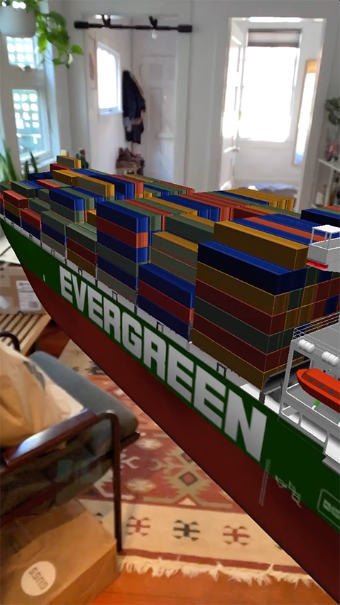

# MV EVERGREEN

Files for the *MV EVERGREEN* Spark AR filter. This filter was made swiftly to joke about the [massive shipping vessel that became lodged in the Suez Canal](https://en.wikipedia.org/wiki/2021_Suez_Canal_obstruction) the week of March 22nd, 2021. The filter allows you to reenact your own catastrophic international incident, from the comfort of your own home.

Filter accessible on [Instagram](https://www.instagram.com/ar/266954011720654/) and [Facebook](https://www.facebook.com/fbcameraeffects/tryit/266954011720654/).

Subfolder `evergreen` contains the Spark AR project files.
